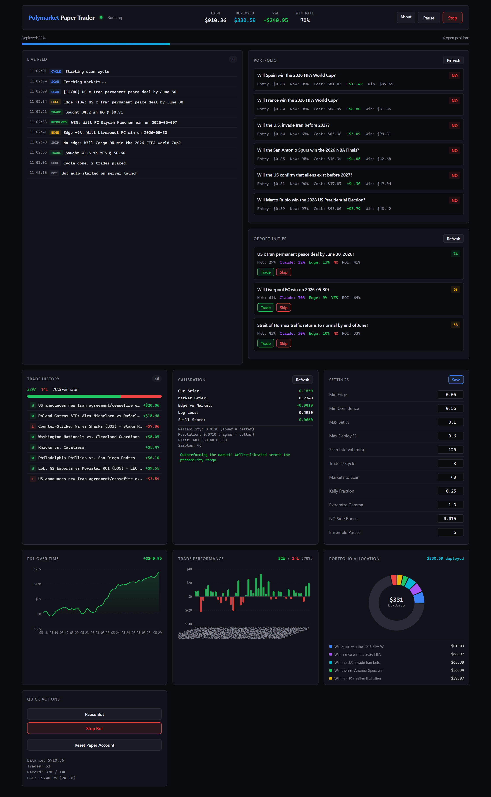

# polymarket-paper-trader

Paper-trading bot for Polymarket. A 5-persona LLM ensemble forecasts each
market, the forecasts get Platt-calibrated against a running outcome log,
and surviving opportunities get sized with the Kelly criterion. Full live
dashboard. Paper money only.



> *Dashboard UI preview — illustrative sample data.*

- **[HOW_IT_WORKS.md](HOW_IT_WORKS.md)** — walks the pipeline end-to-end
  with math and a worked example. Start here if you want to understand
  the system.
- **[public/blog.md](public/blog.md)** — Month 1 writeup with results,
  charts, and the calibration bug I found in my own pipeline.

## Highlights

- 5 parallel `claude --print` personas per market → combined in log-odds
  space → extremize transform → Platt scaling
- Quarter-Kelly sizing for binary contracts, with per-bet / per-day /
  per-event-cluster exposure caps
- Brier score with reliability / resolution / uncertainty decomposition,
  benchmarked against the market's own Brier
- Cross-market correlation detection + NegRisk arbitrage detection
- FastAPI + asyncio autopilot loop, WebSocket streaming to a React/Vite
  dashboard
- All trades, forecasts and outcomes persisted to JSON; nightly export
  to CSV + Markdown via [`analytics.py`](analytics.py)

## Architecture

| File | What it does |
|---|---|
| [engine.py](engine.py) | Market fetching, ensemble analysis, Kelly sizing, calibration, exits |
| [server.py](server.py) | FastAPI backend, WebSocket, autopilot loop |
| [polymarket_paper.py](polymarket_paper.py) | CLI entry point wrapping the engine |
| [analytics.py](analytics.py) | PnL export, calibration backfill, chart generation |
| [dashboard/](dashboard/) | React + Vite frontend |
| [trades.json](trades.json) | Persistent portfolio state |
| [calibration.json](calibration.json) | Forecast + outcome log |
| [public/](public/) | Generated reports + charts (regenerated by `analytics.py`) |

## Running

```bash
python server.py                  # http://localhost:8000, bot auto-starts
cd dashboard && npm run build     # rebuild frontend
python analytics.py               # refresh public/ CSVs, charts, reports
```

Requires Python 3.11+ and the `claude` CLI on `PATH`.

## Status

Month 1 (28 days, 110 resolved trades): **+$6.54 realized on $1,000**.
Strategy is currently *trailing* the market on Brier score
(0.285 vs 0.250). The blog explains why and what's next.

## License

MIT.
