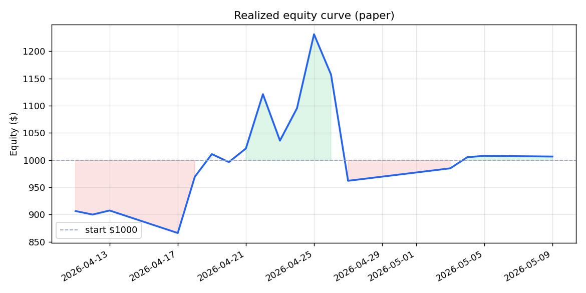
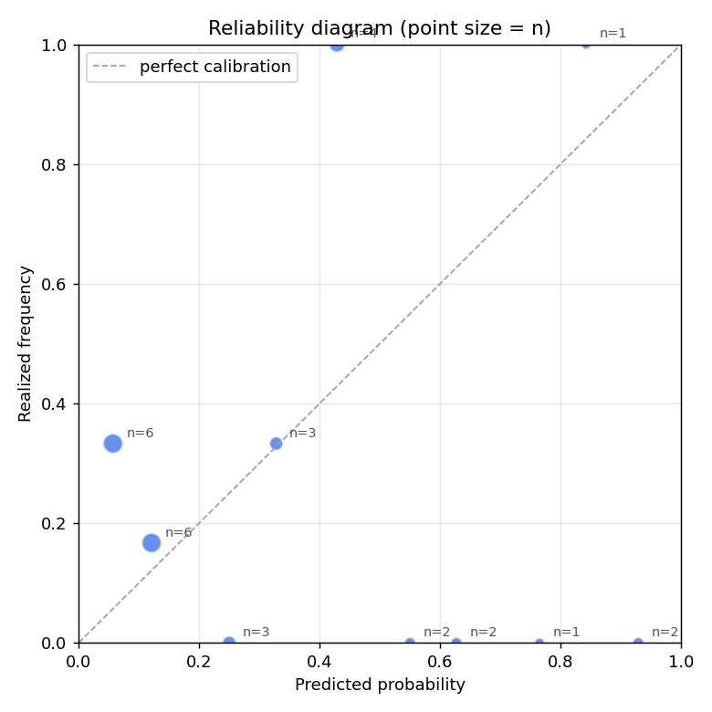

# A Polymarket paper trader with Kelly sizing and Bayesian calibration

_Month 1 writeup. ~2,500 lines of Python + React. All numbers below are
reproducible from [trades.csv](trades.csv) and [equity.csv](equity.csv),
re-generated nightly._

I built a paper-trading bot that scans Polymarket every two hours, runs a
5-persona LLM ensemble over each candidate market, sizes the surviving
opportunities with the Kelly criterion, tracks every forecast in a
calibration log, and exposes the whole thing through a live FastAPI +
React dashboard. The point of the project wasn't to make paper money —
it was to build the full feedback loop from market data → forecast →
sized bet → resolved outcome → calibration update, all under proper
risk controls.

This post documents the system, the math, what 28 days of live paper
trading actually produced, and a calibration bug I caught while writing
it.

## TL;DR

- **Stack:** FastAPI backend with WebSocket streaming, asyncio autopilot
  loop, 5 parallel `claude --print` subprocesses per market, React + Vite
  dashboard, JSON persistence.
- **Method:** 5-persona LLM ensemble combined in log-odds space →
  extremize transform → Platt-scaling calibration correction → quarter-
  Kelly sizing for binary contracts → rule-based exits (edge-eroded /
  stop-loss) → calibration log feeds back into the next forecast.
- **Result after 28 days (110 resolved trades):** **+$6.54 realized
  on $1,000**, hit rate 66%, but Brier 0.285 vs market 0.250 — the
  strategy is currently *trailing* the market it bets against. Exit
  logic is profitable; entry logic is net negative.
- **Lesson:** I found a sampling bug in my own calibration pipeline
  while writing this. The Platt scaling was being fit on a sample
  skewed toward my losers. Fixed; details below.

## Realized equity (Month 1)



The chart shows only **realized** equity — money actually banked or lost
on resolved trades. Open positions don't move the line (capital deployed
but not yet resolved is neither a win nor a loss). The bot ran up to
~$1,230 by day 14, gave most of it back over two weeks, and is now flat
at +0.65%. The volatility is real: realized peak-to-trough range is
$365 (36% of starting balance) on a strategy that ended the month
roughly break-even.

## What's in the box

[engine.py](../engine.py) (1,292 lines) is the strategy. The
non-obvious bits:

- **5-persona ensemble** ([engine.py:603](../engine.py:603)): a
  generalist analyst, a base-rate Bayesian, a momentum trader, a
  contrarian, and a calibrated forecaster — each prompted differently
  and run in parallel as `claude --print` subprocesses. Output
  probabilities are combined in **log-odds space**, which is the right
  pool for independent calibrated forecasters: averaging in probability
  space underweights the tails the ensemble agrees on most strongly.
- **Extremize transform**: combined estimates are pushed away from 0.5
  by a tunable `γ=1.3` exponent in log-odds space, correcting the known
  conservative bias of averaged forecasters.
- **Platt-scaling calibration** ([engine.py:189](../engine.py:189)): a
  1-D logistic regression `p_cal = σ(a·logit(p_raw) + b)` fit on every
  resolved prediction, applied to all new forecasts.
- **Kelly sizing for binary contracts** ([engine.py:760](../engine.py:760)):
  the closed-form `f* = (q-p)/(1-p)` for `pay p, win $1` contracts,
  multiplied by `0.25` (quarter-Kelly because LLM estimates are noisy),
  capped at 10% per bet and 15% per same-resolution-day.
- **YES/NO asymmetry** ([engine.py:861](../engine.py:861)): an
  empirical 1.5% edge bonus on NO contracts to exploit the "optimism
  tax" — Polymarket bettors overpay for YES on long-shot markets.
- **Category-aware edge thresholds**: per-category multipliers on the
  minimum-edge filter, plus volume scaling (more liquid market = need
  bigger edge to bet).
- **Cross-market correlation detection**
  ([engine.py:1062](../engine.py:1062)) and **NegRisk arbitrage
  detection** ([engine.py:1138](../engine.py:1138)): the bot won't
  double down on two markets resolving on the same underlying event,
  and it surfaces multi-leg negative-risk opportunities where a basket
  of NO contracts sums to < $1.
- **Brier score with reliability/resolution/uncertainty decomposition**
  ([engine.py:119](../engine.py:119)): so we can tell "calibrated but
  uninformative" from "informative but miscalibrated", and compare our
  Brier to the market's Brier on the same set of resolutions.

[server.py](../server.py) (1,272 lines) is the FastAPI backend. The
autopilot loop runs as an `asyncio` task inside the FastAPI lifespan; a
WebSocket pushes equity / position / trade events to the React dashboard
in real time. There's a non-trivial amount of Windows-specific
subprocess handling — `claude --print` deadlocks on stderr pipes if you
don't `_kill_proc_tree()` on timeout. (I'd rather not have learned that
the way I did.)

[dashboard/](../dashboard/) is React + Vite, served as a static build
from the same FastAPI process. It shows the live equity curve, open
positions with mark-to-market unrealised P&L, calibration plots, and a
trade log.

## The math: Kelly

For a binary contract that pays $1 on YES at entry price `p`, with `q`
your believed win probability:

```
f* = (q - p) / (1 - p)
```

This is the Kelly fraction — the share of bankroll that maximises log
growth. It assumes `q` is known. It isn't: a 5-persona LLM ensemble
gives a noisy estimator of `q` whose error variance I don't know but
suspect is large. Quarter-Kelly is the standard hedge — multiply `f*`
by 0.25 — and it dramatically reduces drawdown in the worst case where
your `q` is biased.

I also cap each bet at 10% of starting balance and total same-day-
resolution exposure at 15%. The day-cap exists because two correlated
NBA bets resolving on the same evening cost me 18% of bankroll in week
one. The cap is a structural fix, not a tuning parameter.

## The math: Bayesian calibration

The pipeline:

1. Log every forecast at trade entry: `(market_id, our_estimate,
   market_price, side, timestamp, outcome=None)`.
2. When the market resolves, fill in `outcome ∈ {0, 1}`.
3. Once we have ≥ 20 resolved predictions, fit Platt scaling by
   gradient descent on log loss: `p_cal = σ(a·logit(p_raw) + b)`.
4. Apply the fitted scaling to all new forecasts before sizing.

The headline metric is **Brier score**, decomposed against the market's
own Brier on the same resolutions:

```
B = (1/n) Σ (forecast_i - outcome_i)²
```

If our Brier isn't lower than the market's, we're not just losing money —
we're providing liquidity to the people who *do* have edge. After 30
resolved predictions:

- Our Brier: **0.285**
- Market Brier: **0.250**
- Skill margin: **−0.035** (negative = trailing)



The reliability diagram tells the same story visually: forecasts above
0.5 mostly realized at 0%, forecasts in the 0.4–0.5 bin all hit. The
sample sizes per bin are small (1–6) so this is suggestive, not
conclusive — but the *direction* is consistent with the bot being
systematically overconfident on high-probability calls. Exactly the
miscalibration Platt is supposed to correct.

## What the trades actually say

| Exit type | N | Hit rate | PnL | ROI on cost |
|---|---:|---:|---:|---:|
| edge_eroded (early profit-take) | 60 | 100% | **+$803.82** | +42% |
| natural_resolve (held to close) | 30 | 43% | **−$267.08** | −36% |
| stop_loss (−50% on cost) | 20 | 0% | **−$530.20** | −87% |

The most important table in the post. **Exit logic is the entire
strategy.** If I disabled the early-exit rule, the bot would lose ~$800
per $1,000 of capital deployed. The bot's working alpha is that it
gets *into* markets at slightly favourable prices and harvests
convergence before the market moves back.

Two more breakdowns:

| Predicted edge | PnL | ROI |
|---|---:|---:|
| [0.15, 0.20) | +$106 | +20% |
| [0.10, 0.15) | +$62 | +5% |
| [0.05, 0.10) | −$25 | −3% |
| [0.20, ∞) | **−$67** | **−13%** |

The bot is *worst* when it's most confident. The highest predicted
edges lose money on average. This is the overconfidence signature the
calibration was supposed to fix.

| Cost bucket | PnL | ROI |
|---|---:|---:|
| $15–$40 | +$177 | +13% |
| $40–$100 | **−$171** | **−10%** |

Bigger positions lose. Quarter-Kelly with a miscalibrated `q` still
oversizes the cases where the LLM is most wrong.

Full breakdowns by side, category, exit type, edge bucket, and position
size are in [diagnostics.md](diagnostics.md).

## What I'd do differently — and the bug I found

Writing this post is what surfaced the most important thing in it.

While building the analytics layer I noticed the calibration table held
**21 outcomes against 110 resolved trades**. Two bugs:

1. `resolve_prediction()` had a `break` after the first matching pending
   prediction. The same market gets re-analysed on multiple scan cycles
   (25 of 133 markets had ≥ 2 forecasts logged), so up to four out of
   five predictions per market were silently dropped from the
   calibration set.
2. `check_exits()` — the early-exit path that handled 80 of 110
   resolutions — never wrote to `calibration.json` at all. It marks the
   trade as resolved based on price movement, but the binary outcome
   isn't known until the market actually closes. Without a backfill
   pass, those forecasts stayed `outcome=None` indefinitely.

The implication is uglier than the bugs themselves. **The Platt
parameters being applied to live forecasts were fit on a sample
selected for "events where the price didn't move toward my estimate."**
Of course the model thought the bot was poorly calibrated — it was
seeing only the bot's failures. The current Platt fit (`a=0.5, b=−0.33`)
is half-strength extremization learned on a biased subsample. It's not
correct.

Both bugs are fixed
([engine.py:110](../engine.py:110),
[engine.py:943](../engine.py:943))
and a backfill utility in [analytics.py](../analytics.py) caught the
30 natural-resolve markets that were missing. The remaining 80 early-
exit markets need the underlying outcome from the Polymarket API, which
the new `check_resolved()` backfill pass will fill in over the coming
weeks.

## What this project demonstrates

For anyone reading this as a CV link:

- **Bayesian methods in production**: log-odds combination of multiple
  forecasters, Platt scaling fit by gradient descent, Brier
  decomposition (reliability / resolution / uncertainty) used to
  diagnose model behaviour rather than just score it.
- **Optimal sizing under uncertainty**: closed-form Kelly for binary
  contracts, quarter-Kelly hedge against estimator noise, structural
  caps (per-bet, per-day, per-event-cluster) rather than vibes.
- **Real backend engineering**: asyncio autopilot inside a FastAPI
  lifespan, WebSocket event streaming, subprocess orchestration with
  proper timeout / kill-tree handling, persistent JSON state.
- **Honest evaluation**: the strategy isn't beating the market on Brier
  yet, and the post says so. Finding a sampling bug in your own
  evaluation pipeline and writing about it is the work.

## Roadmap (Months 2–3)

Specific things, in priority order:

1. **Let the fixed calibration pipeline run.** The Platt fit on 30
   biased outcomes is not load-bearing. Re-evaluate at N ≥ 100 unbiased
   outcomes.
2. **Drop the `unknown` category.** Ten trades flagged `category=unknown`
   lost $94 (−49% ROI on cost) — almost the entire gross loss on
   resolved trades. The category detector
   ([engine.py:436](../engine.py:436)) is silently failing on a known
   pattern.
3. **Add ensemble disagreement as a confidence signal.** Variance
   across the 5 personas is more informative than the average
   `confidence` field they each report. Tight ensemble agreement →
   bigger position; wide spread → reduce or skip.
4. **Backtest harness.** Right now everything is live paper. A
   replay harness over historical resolved markets would let me iterate
   on the prompt / combination / sizing without waiting weeks.

The bot keeps running. The CSVs in this directory regenerate nightly
from `analytics.py`. Whether the calibration honestly improves over
Months 2–3 will be visible in [equity.csv](equity.csv) without me
writing another word.
